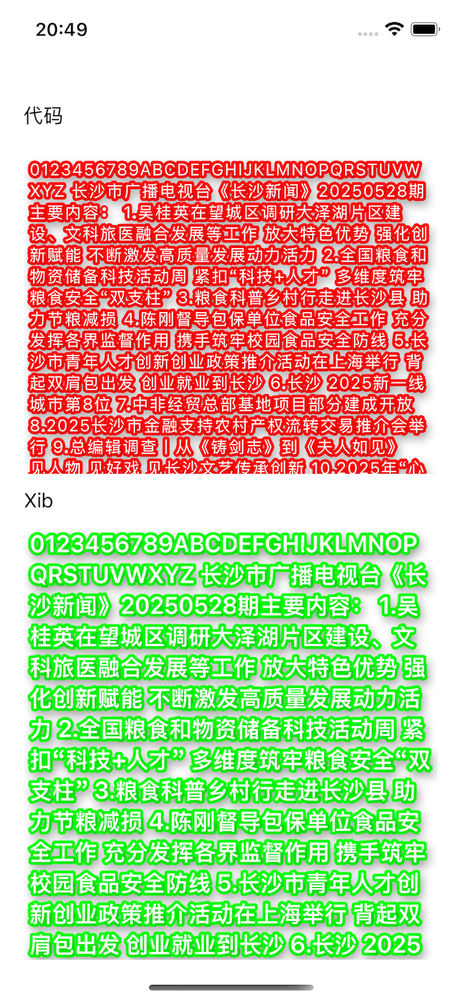

# SmoothOutlinedLabelDemo
自定义 发光字体,是一个支持多行文本、描边（描边宽度与颜色）、文字阴影、自动换行、文字间距、最大行数以及省略号等功能的 自定义 UILabel 替代控件。适用于需要精细文字绘制与高自定义展示效果的 iOS 项目。

## 一、效果图


## 二、用法

```
let label = SmoothOutlinedLabel(frame: CGRect(x: 20, y: 120, width: self.view.frame.size.width-40, height: 280))
view.addSubview(label)

label.text = self.text
label.strokeColor = .red
label.textColor = .white
label.strokeWidth = 5
label.backgroundColor = .clear
label.lineLimit = 0
label.letterSpacing = 1

label.shadowColor = UIColor.black.withAlphaComponent(0.25)
label.shadowOffset = CGSize(width: 2, height: 4)
label.shadowBlur = 8.0
label.font = UIFont.systemFont(ofSize: 14, weight: .regular)
```
## 访问量
